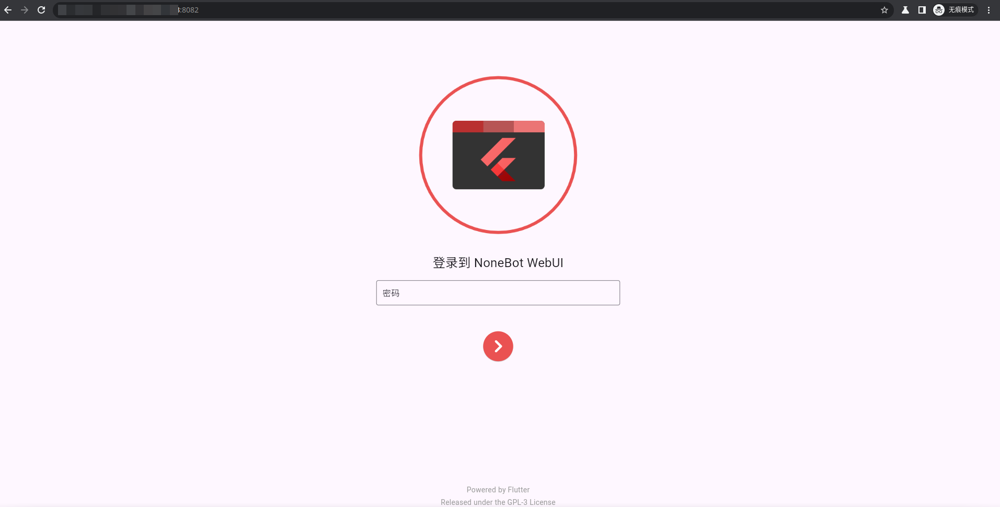
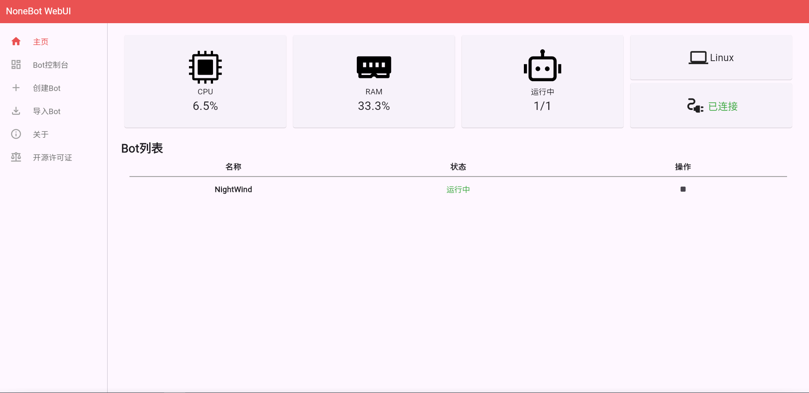
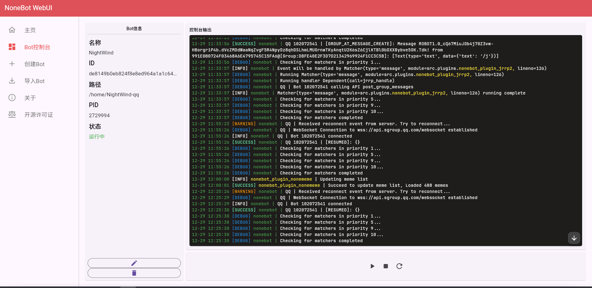
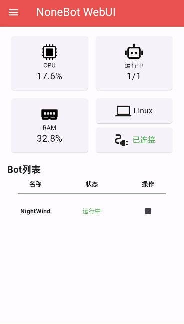
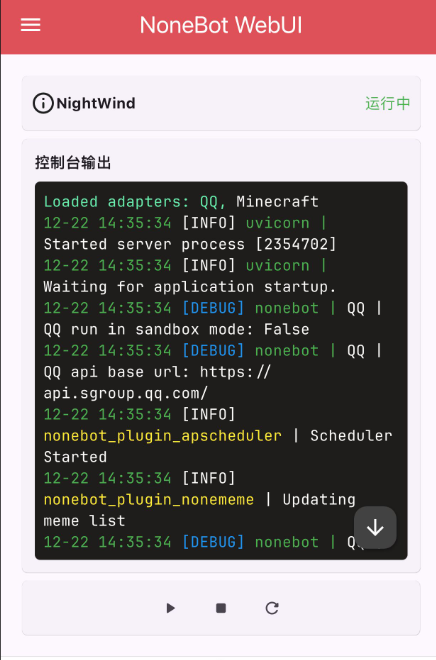
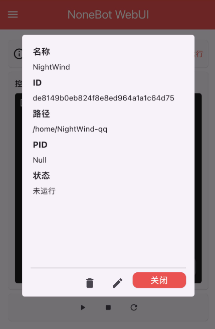

   

# NoneBot WebUI

_✨ 新一代 NoneBot Web 管理界面 ✨_

 
<a href="https://webui.nbgui.top" target="__blank">
  <strong>📖 文档地址</strong>
</a>

## 📖 介绍

新一代 NoneBot Web 管理界面

## 🖼️ 使用截图

    
    
    

## ⚙️安装

即刻前往：[Release](https://github.com/NonebotGUI/nonebot-flutter-webui-dashboard/releases)

## 配置

[查看文档](https://webui.nbgui.top)

## 📑 支持的功能

- [X] 持久化登录
- [X] Bot 列表
- [X] Bot 基本信息
- [X] Bot 启动/停止
- [X] Bot 日志
- [X] Bot 重命名
- [X] Bot 删除
- [X] Bot 创建
- [X] Bot 导入
- [X] 系统占用信息
- [X] 插件启用/禁用
- [X] 插件安装
- [X] 插件卸载
- [X] env.* 配置
- [X] 自动检查更新
- [X] 颜色主题
- [ ] 多节点管理
- [X] 鸣谢

## 📄 许可

GPL-3.0 license

## 🐧 QQ Group

欢迎加入我们的 QQ 群组！

<a href="http://qm.qq.com/cgi-bin/qm/qr?_wv=1027&k=d5JPzIUg6qjJo3E0Zz9vBeUuYNTW3ooC&authKey=xm%2F53DWfXOoz7Is3Llbc9r9E%2FB7AkSV8ERCXf7hI3e%2Fb6ra5gEhoJIfiCzZz6rCz&noverify=0&group_code=972526136" target="__blank">
  <strong>972526136</strong>
</a>
